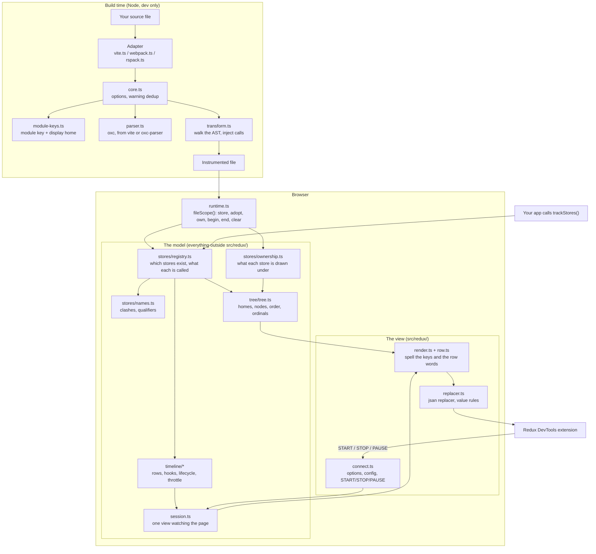
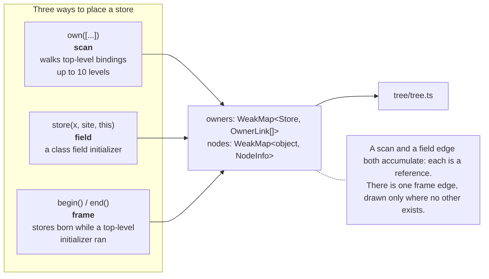
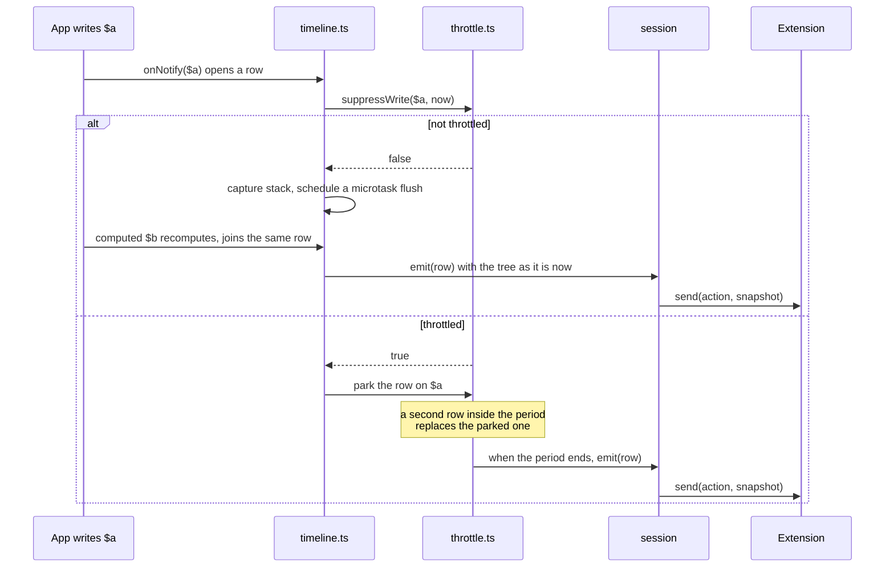

# Architecture

How `nanostores-devtools` works, end to end.

This is a summary for anyone changing the code. What the package shows a developer is in
[REFERENCE.md](./REFERENCE.md), and the shared vocabulary is [GLOSSARY.md](../GLOSSARY.md) in the
repo root. Where this document and the code disagree, the code is right.

---

## 1. What the package does

nanostores stores are plain objects. Nothing about them says where they were written, what they are
called, or what holds them. The Redux DevTools extension can draw a state tree and a timeline, but
it needs names and a shape.

The package fills that gap in two phases:

- **At build time**, a bundler plugin reads the developer's source, finds every call that makes a
  store, and wraps it. The wrapper carries the name, the line and the type.
- **In the browser**, the wrapped calls report to a registry. The package builds a tree out of what
  it learns, listens for writes, and sends both to the Redux DevTools extension.

Two rules shape almost every decision in the code:

1. **Watching an app must not change how it behaves.** Above all, reading a store must not mount it.
2. **Every name in the tree is a name the developer wrote.** A binding, a property key, an array
   index, a `Map` key, a class name, a function name. Where no such name exists, the tree says
   `ref#1` instead of inventing one.

---

## 2. The whole pipeline



---

## 3. Build time: discovery

Everything under `src/discovery/` runs in Node, during development only. It never reaches a shipped
bundle.

### 3.1 The three adapters

| file         | bundler | dev-only check                                      |
| ------------ | ------- | --------------------------------------------------- |
| `vite.ts`    | Vite    | `apply: "serve"`, so Vite never loads it in a build |
| `webpack.ts` | webpack | refuses unless `mode === "development"`, and warns  |
| `rspack.ts`  | Rspack  | the same, through the shared factory                |

webpack and Rspack share `webpack-like.ts`, because Rspack copies webpack's words for everything
this adapter touches. All three are built with `unplugin`.

An adapter answers only five questions. Everything else is shared:

- Is this a dev build?
- What are the roots (the bundler root, plus the wider project root)?
- What shape does a module id have on this bundler?
- What is the hot-reload line?
- Where do warnings go?

`core.ts` decides the rest: it reads the options, loads the parser once on the first file, and
remembers every warning it has already printed so a save does not repeat it.

### 3.2 Naming a file

`module-keys.ts` gives each file two names, and the difference matters:

- The **module key** is the path from the bundler root. It is unique, and it is the unit a hot
  reload clears.
- The **display home** is what the developer reads in the panel. `fileKey` can rewrite it, and two
  files can end up sharing one home.

A file is skipped when it sits in `node_modules`, when it is a virtual module, when it is not a
script, or when it is this package's own code. A file outside the bundler root is measured from the
project root instead, so a linked workspace package reads as `packages/…` and not as a long climb of
`../`. Such a file is marked **external**. Its stores are still registered and drawn flat under an
external home, which sorts last. What its top-level bindings hold places nothing in the tree: a
library's own working state is not something the app can act on.

### 3.3 The parser

`parser.ts` tries `vite` first, then `oxc-parser`. Both ship oxc, so the AST is the same. Vite 8 and
later re-export the parser, so a Vite 8 user pays nothing. On webpack, on Rspack and on Vite 6 and 7,
`oxc-parser` has to be installed. If neither is available, `loadParser` throws. The error comes out
of the transform hook, so the first file the plugin touches fails the build with a message naming
the package to install.

### 3.4 The transform

`transform.ts` is the largest file in the package. It walks the AST once and collects six things:

| what it collects                            | why                                                                                |
| ------------------------------------------- | ---------------------------------------------------------------------------------- |
| which local names came from `nanostores`    | so `atom`, `map`, `deepMap`, `computed` and `batched` can be found under any alias |
| a name stack                                | so a store knows the binding, property or index that names it                      |
| top-level bindings, and which are exported  | so a scan at the end of the body can place what each one holds                     |
| top-level initializers that call something  | so a creation frame can be opened around them                                      |
| `// @nanostores-devtools:throttle` comments | so a store can be held to one row a second                                         |
| `// @nanostores-devtools:ignore` comments   | so a store the developer ignored is never wrapped                                  |

It then rewrites the file with `magic-string`, which keeps a source map. Given this input:

```ts
import { atom } from "nanostores";

export const $count = atom(0);
const editor = makeEditor();
```

the output looks like this:

```ts
import { fileScope as __nsdtFileScope } from "nanostores-devtools/runtime";
const __nsdt = __nsdtFileScope("src/cart.ts", "src/cart.ts", false);
__nsdt.clear();
if (import.meta.hot)
  import.meta.hot.prune(() => {
    __nsdt.clear();
  });
import { atom } from "nanostores";

export const $count = __nsdt.store(atom(0), {
  name: "$count",
  fn: null,
  line: 3,
  type: "atom",
});
const editor = __nsdt.end((__nsdt.begin(), makeEditor()), {
  name: "editor",
  fn: null,
  line: 4,
  type: "unknown",
});

__nsdt.own([
  ["$count", $count, true],
  ["editor", editor, false],
]);
```

Three details are worth knowing:

- The header is **one line**, and the `own` call sits on its own line at the end. Every original
  line keeps its place in the source map.
- `clear()` runs at the top of the body on every execution. It does nothing on the first run, and it
  wipes the old stores on every later one. It sits there rather than in a hot hook, because a bundler
  runs its dispose hook only for the module that accepted the update.
- A file is left exactly as written only when it imports no store creator, adopts nothing, and binds
  nothing at the top level. A file that imports `atom` but makes no store today is still
  instrumented, because an edit that took the last store out still has to clear what the run before
  it registered.

`adoptFactories` (on by default) adds a second catch. A call whose result is stored under a name is
wrapped in `adopt()`, even when the function is not a creator we know, so
`const user = createUserStore()` is registered too. `adopt()` hands back a value that is not a store
unchanged, so a call that builds anything else costs one wrapper and nothing more.

An adopted store gets its type from the package to kind map in `src/discovery/store-types.ts`, which
the `storeTypes` option lays entries over. The map answers by the package a call was imported from
and the export name it used, so `persistentAtom` from `@nanostores/persistent` reads as an atom. A
call from a package the map does not know is adopted as `unknown`, and a type the store already
carries always beats the one the map offers.

`enforce: "pre"` puts the walk on the raw source, before the bundler's own TypeScript transform drops
type arguments and collapses blank lines.

---

## 4. The shared global

`src/global.ts` holds everything two copies of the package must agree on, behind
`Symbol.for("nanostores-devtools/v1")`. The key names the shape, not the version, so two copies of
the same major share one registry instead of each drawing half a tree.

What sits behind it:

| field                                              | holds                                                                               |
| -------------------------------------------------- | ----------------------------------------------------------------------------------- |
| `entries`                                          | `Map<Store, StoreEntry>`, the registry itself                                       |
| `byName`                                           | which store holds each name key                                                     |
| `scopes`                                           | one record per instrumented module, keyed by module key                             |
| `homeNames`                                        | which module took which name at which display home                                  |
| `owners`                                           | `WeakMap<Store, OwnerLink[]>`, everything each store is drawn under                 |
| `nodes`                                            | `WeakMap<object, NodeInfo>`, values that hold stores and have no value of their own |
| `bound`                                            | every top-level binding that names each store, and whether it was exported          |
| `frames`                                           | the creation frames open right now                                                  |
| `session`                                          | the one view watching the page, or nothing                                          |
| `nextId`, `creations`, `changeListeners`, `warned` | the id counter, types waiting for a name, registry listeners, warning dedup         |

Every map that could keep app objects alive is weak. Devtools holds nothing the app has let go.

---

## 5. The registry

`src/stores/registry.ts` answers one question: which stores exist, and what is each one called.

There are two ways in:

- **The plugin**, through `runtime.ts`. It knows the name, the line, the enclosing function and the
  type.
- **`trackStores(group, stores)`**, called by hand. It knows a group name and a name per store, and
  nothing else.

A store has one entry for its whole life. A second registration for the same store renames or moves
that entry rather than making another one. The name a developer wrote by hand always beats the name a
creation site derived.

`isStore` tests shape, not `instanceof`: a store is a plain object, and two copies of nanostores make
two different classes. It reads `listen` and `lc` through their descriptors, so an app getter never
runs.

### 5.1 Telling two stores apart

An entry carries a `label` for a reader and a `nameKey` for identity. Where two stores would collide,
qualifiers are added, in one fixed order:

```
$counter (a.ts, makeCart, line 12) #2
   ^        ^         ^        ^     ^
   name    file      fn      line   which store of that site
```

- The **file** appears when two modules share one display home. This can only happen through
  `fileKey`.
- The **place** (`fn, line`) appears when two lines in one module make a store with the same name.
- The **number** appears when one creation site makes several stores, such as a factory in a loop.

Both sides of a clash take the qualifier. One bare `$counter` next to `$counter (line 20)` would not
say which line the bare one came from. `names.ts` also warns once per clash.

---

## 6. Ownership: what each store is drawn under

The registry knows which stores exist. It does not know what holds them. That is
`src/stores/ownership.ts`, and it registers nothing.

Three mechanisms record an owner, and each one knows a different amount:



**The scan** runs at the end of the module body, where every top-level binding holds its value. It
walks each binding up to ten levels deep, and every member of a collection it meets. It reads only
own data properties, so an app getter never runs. An array is named by index, a `Map` by key, a `Set` by
insertion order. Every name it produces is one the developer could type to reach that member.

**The field mechanism** catches a store made in a class field initializer, where `this` is the new
instance (or the class itself, for a static field). The instance has no name yet, so it becomes
`ref#1` until a binding renames it.

**The frame** is the only one that reaches a store kept in a closure. `begin()` opens before a
top-level initializer runs, `end()` closes on the value it returned. Everything born in between is
placed under that value. A frame around an `await` is dropped: it must close in the same tick, or it
would catch every store made anywhere until it did.

A frame only knows _when_ a store was born, so it is the weakest claim. The other two know a real
name, so each of them is a reference the developer wrote and every one of them draws. A frame is not
a reference: there is at most one frame edge, and the tree draws it only where the store has no other
edge at all.

Two refusals matter, plus one cleanup rule:

- A store still homed in somebody else's file is not drawn under the developer's binding. It is the
  library's own working state, and drawing it would say the app holds something its author never
  handed out.
- An edge that would close a loop is refused, searching every owner and every parent. That is also
  why the tree build needs no depth bound.
- A hot reload drops the edges and binding names the module wrote and no other module's. Every record
  carries the module key, and the module scope keeps a weak set of what it linked, because a
  `WeakMap` cannot be listed.

---

## 7. The tree

`src/tree/tree.ts` turns entries plus ownership into a model. It holds no key strings.

The top level is a list of **homes**, in this order: groups written by hand, then the developer's own
files, then external files. Under a home sit three kinds of node:

| kind     | is                                                                                                                                |
| -------- | --------------------------------------------------------------------------------------------------------------------------------- |
| `store`  | a store at a place of its own, with whatever it owns under it                                                                     |
| `repeat` | a store expanded somewhere else. Value only, no children                                                                          |
| `holder` | a thing that holds others and has no value of its own: a class instance, an object a factory returned, an array, a `Map`, a `Set` |

**Every reference the developer wrote draws.** Two bindings for one store are two references, and so
are two containers holding one store. The value is expanded under its first placement and every other
placement shows it and stops, or the tree would say the app holds twice as many stores as it does. A
`repeat` carries the store's value, which is the point of a store; a `holder` drawn again carries
`expandedAt`, the label of the placement that expands it, which the view spells `(drawn under)`.

Siblings that would still share one name are separated in three passes: first by the store's own
qualifiers, then by its home, then by a number. Both sides always take the qualifier.

`tree/slot.ts` reads what a store holds, always as `.value` through its descriptor and never through
`get()`. It answers one of three states:

- `live` — the value can be trusted.
- `stale` — the store is unmounted and its value may be out of date.
- `never-computed` — a derived store that was never mounted and holds `undefined`.

`tree/drawn.ts` holds the other half of visibility. A view must call `noteDrawn` for every store its
value walk draws. Without it, the model would drop timeline rows for stores the developer can plainly
see inside another store's value.

---

## 8. The timeline

`src/timeline/` builds rows. A row says what it is about, what happened, and which stores moved. It
holds no word the panel prints.

### 8.1 Hooks

`hooks.ts` attaches nanostores hooks when `connectDevtools()` finds the extension, and only then.
Registration only records the store; the hooks attach at connect.

| store type                              | hooks                             | why                                                                        |
| --------------------------------------- | --------------------------------- | -------------------------------------------------------------------------- |
| everything but `computed` and `batched` | `onSet` flushes, `onNotify` opens | the two sit on opposite sides of the write                                 |
| `computed`, `batched`                   | `onNotify` only                   | a computed sets itself mid-cascade, and flushing there would split the row |
| every type                              | `onStart`, `onStop`               | mount and unmount rows                                                     |

The `onSet` / `onNotify` order is the whole correctness of the timeline. Inside `onSet` the store
still holds the old value. Inside `onNotify` it holds the new one. Flushing from `onNotify` would
snapshot the next store's new value into this store's row.

### 8.2 One row, one turn



A recompute joins the open row instead of opening one, so a write and the whole cascade behind it
read as a single row. The open row closes lazily: the next direct write closes it, or a microtask
does.

Registry rows work the other way round. They wait for the end of the turn and are grouped by module,
so one hot reload draws a single `hotReload` row rather than a burst of paired register and
unregister rows.

### 8.3 Throttling

A store is held to one row a second in three ways:

- `// @nanostores-devtools:throttle 100` above the store, read by the plugin.
  `// @nanostores-devtools:no-throttle` spares it instead, and `// @nanostores-devtools:ignore`, the
  third comment the transform reads, settles the question before a rate is asked for: the statement
  below it is never wrapped, so there is no store to hold back.
- The `throttle` option, a list of `home/name` or a rule over them.
- Automatically, when a store writes more than 10 times in a second. It warns once, and it never
  releases the store again: a store that wrote in bursts once is expected to do it again.

A parked row costs nothing while it waits. No tree is built and nothing is sent until the timer
fires. The row keeps the timestamp of the write that made it, and its tree is built at release, so
it carries the current value with the whole cascade that rode inside it.

### 8.4 A row needs a store somebody can see

A row is drawn only for a store the developer can find: one at a key of its own, or one drawn inside
another store's value. `tree/placement.ts` answers that for the tree and for the timeline both, so
the two can never disagree about which stores exist.

---

## 9. The view: talking to the extension

`src/redux/` is the only folder that knows the extension exists.

### 9.1 Connect

`connect.ts` reads the options, builds the config, and opens the connection. Notable choices:

- With no extension, nothing is logged. `handle.connected` is `false`, and that is what a developer
  who wonders why nothing shows up should read.
- The first tree is sent at the end of the turn, not at once. Registration happens at import time, so
  an early connect would otherwise send a nearly empty tree followed by a burst of joins.
- `features` is passed in full. The extension turns everything on when the object is missing, which
  would give a read-only bridge jump, dispatch and import buttons that all do nothing.
- `trace` is a function of ours. The extension's own `trace: true` captures inside its `send`, which
  for us is flush time, so it would point at our flush and not at the write.
- `PAUSE_RECORDING` stops the tree build on our side, not only the send on theirs.

### 9.2 Spelling

`render.ts` turns the tree model into the object the panel reads. Every key string is written here
and nowhere else:

```
$total [computed] (a.ts, line 4) #2
  ^         ^            ^         ^
 name     type       qualifier  ordinal
```

`keys.ts` holds the four invented key names: `(value)`, `…`, `(valueOf)` and `(toString)`. A store
that owns nothing is drawn as its value alone. One that owns others gets its own value under
`(value)` and its children beside it.

`row.ts` writes the row's `type` and the changes the panel lists.

### 9.3 The replacer

`replacer.ts` is handed to the extension as jsan's replacer. It runs for every key of every tree, and
it does four jobs:

1. **Copies what jsan would read directly.** jsan reads members with a plain property read, which
   would run an app getter. A copy taken from the descriptors is the only read we control.
2. **Keeps one wrapper object per source value.** jsan spots a repeat by identity, so a fresh object
   on every call would let a value that holds itself repeat until the stack runs out.
3. **Spells stores the same way everywhere.** A store inside a value gets a key with its type,
   `$checked [computed]`, and its value beneath it, exactly as the tree draws it.
4. **Caps what a class instance may show.** Five levels down and 100 members wide by default. Both
   counts start at a class instance, so plain app state above one is never touched.

`platform-rules.ts` adds rules for platform classes such as `Headers`, `FormData` and boxed
primitives. The developer's own serializers run first, so a rule of theirs always wins.

---

## 10. The model and view boundary

Everything under `src/` outside `src/redux/` and `src/testing/` is the **model**. `src/redux/*.ts` is
the **view**.

**A model file never imports a view file.** The other direction is free. `src/boundary.test.ts` reads
every relative import under `src/` and fails on a crossing. There is no exception list.

`src/values/` has a second, stricter wall: nothing in it imports outside the folder, apart from
`limits.ts` reaching for `warnOnce`. Reading a value is a question about the value alone.

A view supplies four things through `Session`:

| the view provides                                       | called when                                                      |
| ------------------------------------------------------- | ---------------------------------------------------------------- |
| `active()`                                              | before anything is built, because the tree is the expensive half |
| `emit(row)`                                             | at the end of a turn, and when a parked row's period ends        |
| `emitAll()`                                             | on connect, and when a panel starts watching again               |
| `noteDrawn(store)` for every store its value walk draws | never called by the model; it reads the record back              |

The fourth is the one that gets forgotten. Nothing fails loudly when a view skips it. It quietly
stops drawing rows for every store that is only reachable inside another store's value.

---

## 11. Packaging

Five entry points:

| subpath                       | source                     | runs in        | may depend on                                                |
| ----------------------------- | -------------------------- | -------------- | ------------------------------------------------------------ |
| `nanostores-devtools`         | `src/index.ts`             | browser        | `nanostores` (peer)                                          |
| `nanostores-devtools/runtime` | `src/runtime.ts`           | browser        | nothing                                                      |
| `nanostores-devtools/vite`    | `src/discovery/vite.ts`    | Node, dev only | `magic-string`, `unplugin`; `vite` and `oxc-parser` optional |
| `nanostores-devtools/webpack` | `src/discovery/webpack.ts` | Node, dev only | the same, without `vite`                                     |
| `nanostores-devtools/rspack`  | `src/discovery/rspack.ts`  | Node, dev only | the same                                                     |

Three things keep a production bundle clean:

- The `production` export condition resolves the main entry to `src/noop.ts`: the same three names,
  the same types, empty bodies. Every import there is type-only.
- `sideEffects: false`, so no top-level code runs on import.
- The plugins refuse to run in a production build. Vite never even loads ours.

`tsdown` builds every non-test file unbundled, so a new source file becomes a new output file rather
than a bigger bundle. `isolatedDeclarations` is on, so every exported value needs an explicit type.

---

## 12. Rules to keep in mind when changing this code

1. **Never call `store.get()`.** For a `computed`, `get()` can re-enter `set()` and mount sources
   that were unmounted. Always read `.value` through its own property descriptor.
2. **Never trust `onSet.newValue`.** It is wrong for `deepMap`: it holds a flat `"a.b"` key instead
   of the nested value.
3. **Never read a getter the app wrote.** Every read of a value we did not build goes through
   `Object.getOwnPropertyDescriptor` and takes a data descriptor only. The one exception is the
   `stack` accessor V8 installs on an error itself.
4. **Nothing inside a nanostores listener may throw out of it.** Catch, warn once, keep the tree as
   it was. One throwing listener can stop every store listener on the page.
5. **A written name beats a derived one.** A binding the developer typed wins over the name a
   creation site worked out.
6. **Warn once per kind, per subject.** `warnOnce` in `src/utils/warn.ts`. Once per page hides a
   second bug behind the first; once per occurrence floods the console.
